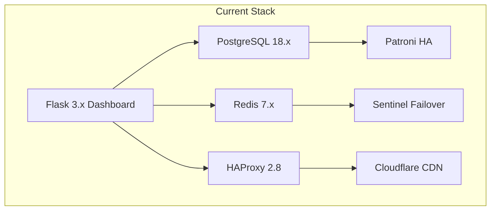
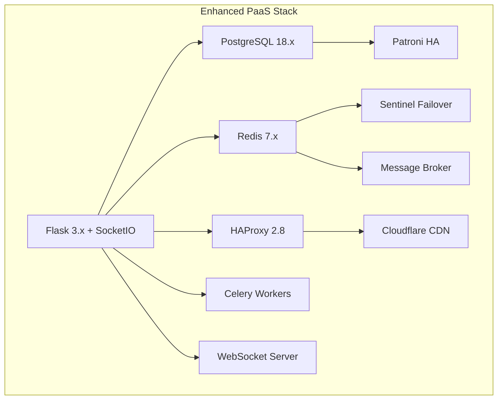
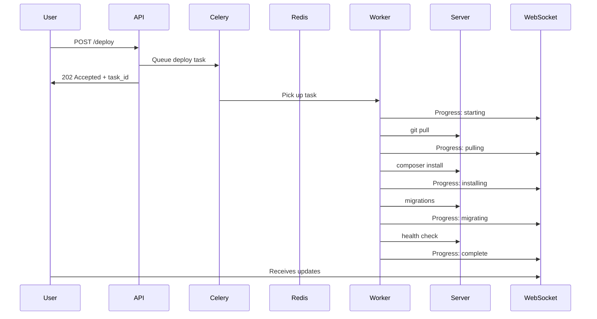

# PaaS Architecture Reference

> Comprehensive architecture analysis based on Coolify PaaS patterns, adapted for Quantyra infrastructure.

## Executive Summary

This document analyzes key architectural patterns from Coolify (an open-source PaaS) and provides recommendations for enhancing the Quantyra infrastructure dashboard. The goal is to evolve the current Flask dashboard into a full-featured private PaaS while maintaining compatibility with existing infrastructure components.

### Key Takeaways

| Pattern | Coolify Approach | Quantyra Application | Priority |
|---------|------------------|---------------------|----------|
| Action Pattern | Domain-driven command classes | Python action classes for SSH operations | HIGH |
| SSH Remote Execution | Direct server control via SSH | Already implemented, needs enhancement | MEDIUM |
| Queue-Based Deployments | Background job processing | Celery + Redis for async deploys | HIGH |
| Polymorphic Resources | Flexible resource types | Database, domain, service abstraction | MEDIUM |
| WebSocket Progress | Real-time deployment status | flask-socketio + Redis pub/sub | HIGH |

## Technology Stack Comparison

### Current Quantyra Stack



### Recommended Enhancements



### Stack Additions Required

| Component | Purpose | Implementation |
|-----------|---------|----------------|
| Celery | Background job queue | Deploy, backup, SSL provisioning |
| Redis (Message Broker) | Celery broker | Use existing Redis with dedicated DB |
| flask-socketio | WebSocket support | Real-time deployment progress |
| Eventlet/Gevent | Async workers | WebSocket async support |
| PostgreSQL Schema | Resource tracking | New tables for PaaS entities |

## Key Patterns to Adopt

### 1. Action Pattern (Domain-Driven Design)

**What it is:** Encapsulate infrastructure operations as discrete, testable command classes.

**Coolify Example (PHP):**
```php
class DeployApplication
{
    public function execute(Application $application): void
    {
        $this->pullCode();
        $this->installDependencies();
        $this->runMigrations();
        $this->restartServices();
    }
}
```

**Python Adaptation for Quantyra:**
```python
# services/actions/base.py
from abc import ABC, abstractmethod
from dataclasses import dataclass
from typing import Optional

@dataclass
class ActionResult:
    success: bool
    message: str
    output: Optional[str] = None
    error: Optional[str] = None

class BaseAction(ABC):
    """Base class for all infrastructure actions."""
    
    def __init__(self, app_name: str, server_ip: str):
        self.app_name = app_name
        self.server_ip = server_ip
        self.ssh_client = None
    
    @abstractmethod
    def execute(self) -> ActionResult:
        """Execute the action and return result."""
        pass
    
    def pre_execute(self) -> bool:
        """Validation before execution."""
        return True
    
    def post_execute(self, result: ActionResult) -> None:
        """Cleanup after execution."""
        pass

# services/actions/deploy.py
class DeployApplicationAction(BaseAction):
    """Deploy application to a server."""
    
    def __init__(self, app_name: str, server_ip: str, branch: str, environment: str):
        super().__init__(app_name, server_ip)
        self.branch = branch
        self.environment = environment
    
    def execute(self) -> ActionResult:
        try:
            # Step 1: Pull code
            result = self._git_pull()
            if not result.success:
                return result
            
            # Step 2: Install dependencies
            result = self._install_dependencies()
            if not result.success:
                return result
            
            # Step 3: Run migrations
            result = self._run_migrations()
            if not result.success:
                return result
            
            # Step 4: Restart services
            result = self._restart_services()
            
            return result
        except Exception as e:
            return ActionResult(success=False, message=str(e), error=str(e))
```

**Benefits:**
- Single responsibility per action
- Easy to test in isolation
- Clear rollback points
- Reusable across API/UI/webhooks

### 2. SSH-Based Remote Execution

**Current Implementation:** Direct SSH commands via `subprocess`

**Enhanced Pattern:**
```python
# services/ssh/pool.py
import paramiko
from typing import Dict, Optional
from contextlib import contextmanager

class SSHConnectionPool:
    """Pool of SSH connections for efficient remote execution."""
    
    _instance = None
    _pool: Dict[str, paramiko.SSHClient] = {}
    
    def __new__(cls):
        if cls._instance is None:
            cls._instance = super().__new__(cls)
        return cls._instance
    
    @contextmanager
    def get_connection(self, host: str, username: str = "root", 
                       key_path: str = "/root/.ssh/id_vps"):
        """Get or create SSH connection from pool."""
        key = f"{username}@{host}"
        
        if key not in self._pool:
            client = paramiko.SSHClient()
            client.set_missing_host_key_policy(paramiko.AutoAddPolicy())
            client.connect(host, username=username, key_filename=key_path)
            self._pool[key] = client
        
        try:
            yield self._pool[key]
        except Exception:
            # Remove broken connection
            if key in self._pool:
                self._pool[key].close()
                del self._pool[key]
            raise
    
    def execute(self, host: str, command: str, timeout: int = 300) -> tuple:
        """Execute command on remote host."""
        with self.get_connection(host) as client:
            stdin, stdout, stderr = client.exec_command(command, timeout=timeout)
            return stdout.read().decode(), stderr.read().decode(), stdout.channel.recv_exit_status()

# Usage
ssh_pool = SSHConnectionPool()
stdout, stderr, exit_code = ssh_pool.execute("100.92.26.38", "systemctl status nginx")
```

### 3. Queue-Based Deployments

**Current State:** Synchronous deployments (blocking)

**Recommended Architecture:**



**Implementation:**
```python
# tasks/deploy.py
from celery import Celery, shared_task
from celery.result import AsyncResult
import redis

app = Celery('quantyra', broker='redis://100.126.103.51:6379/1')

@shared_task(bind=True)
def deploy_application(self, app_name: str, branch: str, environment: str):
    """Background task for application deployment."""
    
    # Redis pub/sub for progress updates
    r = redis.Redis(host='100.126.103.51', port=6379, db=2)
    channel = f"deploy:{self.request.id}"
    
    def emit_progress(step: str, status: str, data: dict = None):
        r.publish(channel, json.dumps({
            'step': step,
            'status': status,
            'data': data or {}
        }))
    
    try:
        emit_progress('start', 'running', {'app': app_name})
        
        # Get app config
        app_config = load_app_config(app_name)
        servers = get_app_servers(app_name)
        
        # Deploy to each server
        for server in servers:
            emit_progress('deploy', 'running', {'server': server['name']})
            
            action = DeployApplicationAction(
                app_name=app_name,
                server_ip=server['ip'],
                branch=branch,
                environment=environment
            )
            result = action.execute()
            
            if not result.success:
                emit_progress('failed', 'error', {'error': result.error})
                raise Exception(result.error)
            
            emit_progress('server_complete', 'success', {'server': server['name']})
        
        emit_progress('complete', 'success', {'app': app_name})
        
    except Exception as e:
        emit_progress('failed', 'error', {'error': str(e)})
        raise
```

### 4. Polymorphic Relationships

**Use Case:** Different resource types (database, service, domain) with shared behavior.

**Database Schema:**
```sql
-- Base resource table
CREATE TABLE resources (
    id UUID PRIMARY KEY DEFAULT gen_random_uuid(),
    app_id UUID NOT NULL REFERENCES applications(id),
    type VARCHAR(50) NOT NULL, -- 'database', 'domain', 'service', 'volume'
    name VARCHAR(255) NOT NULL,
    status VARCHAR(50) DEFAULT 'pending',
    config JSONB DEFAULT '{}',
    created_at TIMESTAMP DEFAULT NOW(),
    updated_at TIMESTAMP DEFAULT NOW()
);

-- Type-specific tables
CREATE TABLE resource_databases (
    resource_id UUID PRIMARY KEY REFERENCES resources(id) ON DELETE CASCADE,
    db_name VARCHAR(255) NOT NULL,
    db_user VARCHAR(255) NOT NULL,
    db_password_encrypted TEXT NOT NULL,
    db_port INTEGER DEFAULT 5432,
    db_size_mb INTEGER
);

CREATE TABLE resource_domains (
    resource_id UUID PRIMARY KEY REFERENCES resources(id) ON DELETE CASCADE,
    domain_name VARCHAR(255) NOT NULL,
    ssl_enabled BOOLEAN DEFAULT TRUE,
    ssl_provider VARCHAR(50) DEFAULT 'letsencrypt',
    ssl_expires_at TIMESTAMP,
    cdn_enabled BOOLEAN DEFAULT TRUE
);

CREATE TABLE resource_services (
    resource_id UUID PRIMARY KEY REFERENCES resources(id) ON DELETE CASCADE,
    service_type VARCHAR(50) NOT NULL, -- 'nginx', 'php-fpm', 'nodejs', 'redis'
    port INTEGER,
    process_count INTEGER,
    memory_limit_mb INTEGER
);
```

**Python Model:**
```python
# models/resources.py
from enum import Enum
from typing import Optional
from pydantic import BaseModel
from datetime import datetime
import uuid

class ResourceType(str, Enum):
    DATABASE = "database"
    DOMAIN = "domain"
    SERVICE = "service"
    VOLUME = "volume"

class ResourceStatus(str, Enum):
    PENDING = "pending"
    PROVISIONING = "provisioning"
    ACTIVE = "active"
    FAILED = "failed"
    DELETED = "deleted"

class Resource(BaseModel):
    id: uuid.UUID
    app_id: uuid.UUID
    type: ResourceType
    name: str
    status: ResourceStatus = ResourceStatus.PENDING
    config: dict = {}
    created_at: datetime
    updated_at: datetime

class DatabaseResource(Resource):
    type: ResourceType = ResourceType.DATABASE
    db_name: str
    db_user: str
    db_password_encrypted: str
    db_port: int = 5432
    db_size_mb: Optional[int] = None

class DomainResource(Resource):
    type: ResourceType = ResourceType.DOMAIN
    domain_name: str
    ssl_enabled: bool = True
    ssl_provider: str = "letsencrypt"
    ssl_expires_at: Optional[datetime] = None
    cdn_enabled: bool = True
```

### 5. Encrypted Secret Storage

**Current:** SOPS-encrypted YAML files

**Enhanced Pattern:**
```python
# services/secrets/vault.py
from cryptography.fernet import Fernet
from cryptography.hazmat.primitives import hashes
from cryptography.hazmat.primitives.kdf.pbkdf2 import PBKDF2HMAC
import base64
import os
import json

class SecretVault:
    """Encrypted secret storage with scope support."""
    
    def __init__(self, master_key: bytes = None):
        if master_key is None:
            master_key = self._load_or_generate_key()
        self.fernet = Fernet(master_key)
    
    def _load_or_generate_key(self) -> bytes:
        """Load key from environment or generate new one."""
        key_path = "/opt/dashboard/secrets/vault.key"
        
        if os.path.exists(key_path):
            with open(key_path, 'rb') as f:
                return f.read()
        
        key = Fernet.generate_key()
        with open(key_path, 'wb') as f:
            f.write(key)
        os.chmod(key_path, 0o600)
        return key
    
    def encrypt_secret(self, value: str) -> str:
        """Encrypt a secret value."""
        return self.fernet.encrypt(value.encode()).decode()
    
    def decrypt_secret(self, encrypted: str) -> str:
        """Decrypt a secret value."""
        return self.fernet.decrypt(encrypted.encode()).decode()
    
    def store_app_secrets(self, app_name: str, secrets: dict, scope: str = "shared"):
        """Store secrets for an application with scope."""
        secrets_file = f"/opt/dashboard/secrets/{app_name}.json"
        
        # Load existing
        data = {}
        if os.path.exists(secrets_file):
            with open(secrets_file, 'r') as f:
                data = json.load(f)
        
        # Encrypt and store
        if scope not in data:
            data[scope] = {}
        
        for key, value in secrets.items():
            data[scope][key] = self.encrypt_secret(value)
        
        with open(secrets_file, 'w') as f:
            json.dump(data, f, indent=2)
        os.chmod(secrets_file, 0o600)
    
    def get_app_secrets(self, app_name: str, scope: str = None) -> dict:
        """Get decrypted secrets for an application."""
        secrets_file = f"/opt/dashboard/secrets/{app_name}.json"
        
        if not os.path.exists(secrets_file):
            return {}
        
        with open(secrets_file, 'r') as f:
            data = json.load(f)
        
        result = {}
        for s, secrets in data.items():
            if scope is None or s == scope:
                result[s] = {k: self.decrypt_secret(v) for k, v in secrets.items()}
        
        return result
```

## Architecture Recommendations

### 1. Modular Service Architecture

Refactor the monolithic `app.py` into separate service modules:

```
dashboard/
├── app.py                 # Flask app + routes (thin)
├── config.py              # Configuration loading
├── models/
│   ├── __init__.py
│   ├── application.py     # Application model
│   ├── database.py        # Database model
│   ├── domain.py          # Domain model
│   └── resource.py        # Base resource model
├── services/
│   ├── __init__.py
│   ├── deploy.py          # Deployment orchestration
│   ├── domain.py          # Domain provisioning
│   ├── ssl.py             # SSL certificate management
│   ├── ssh.py             # SSH connection pool
│   ├── cloudflare.py      # Cloudflare API client
│   └── secrets.py         # Secret vault
├── actions/
│   ├── __init__.py
│   ├── base.py            # Base action class
│   ├── deploy.py          # Deploy action
│   ├── rollback.py        # Rollback action
│   └── provision.py       # Provision action
├── tasks/
│   ├── __init__.py
│   ├── deploy.py          # Celery deploy task
│   ├── backup.py          # Celery backup task
│   └── ssl_renew.py       # Celery SSL renewal task
└── websocket/
    ├── __init__.py
    └── handlers.py        # Socket.IO event handlers
```

### 2. Event-Driven Updates

**WebSocket Integration:**
```python
# websocket/handlers.py
from flask_socketio import SocketIO, emit, join_room
from flask import request

socketio = SocketIO(message_queue='redis://100.126.103.51:6379/2')

@socketio.on('connect')
def handle_connect():
    """Client connected to WebSocket."""
    emit('connected', {'status': 'ok'})

@socketio.on('subscribe_deploy')
def handle_subscribe_deploy(data):
    """Subscribe to deployment progress updates."""
    task_id = data.get('task_id')
    join_room(f"deploy:{task_id}")
    emit('subscribed', {'task_id': task_id})

@socketio.on('subscribe_app')
def handle_subscribe_app(data):
    """Subscribe to application updates."""
    app_name = data.get('app_name')
    join_room(f"app:{app_name}")

# Emit from Celery task
def emit_deploy_progress(task_id: str, step: str, status: str, data: dict = None):
    """Emit deployment progress to subscribed clients."""
    socketio.emit('deploy_progress', {
        'step': step,
        'status': status,
        'data': data or {}
    }, room=f"deploy:{task_id}")
```

### 3. Sentinel Agent Pattern (Optional Advanced Feature)

**Purpose:** Lightweight monitoring agents on each server.

```python
# sentinel/agent.py (deployed to each server)
from flask import Flask, jsonify
import psutil
import docker
import subprocess

app = Flask(__name__)

@app.route('/health')
def health():
    return jsonify({'status': 'ok'})

@app.route('/metrics')
def metrics():
    return jsonify({
        'cpu_percent': psutil.cpu_percent(),
        'memory_percent': psutil.virtual_memory().percent,
        'disk_percent': psutil.disk_usage('/').percent,
        'load_average': os.getloadavg()
    })

@app.route('/containers')
def containers():
    client = docker.from_env()
    return jsonify([{
        'name': c.name,
        'status': c.status,
        'ports': c.ports
    } for c in client.containers.list()])

@app.route('/services/<service_name>')
def service_status(service_name):
    result = subprocess.run(
        ['systemctl', 'is-active', service_name],
        capture_output=True
    )
    return jsonify({
        'service': service_name,
        'active': result.returncode == 0
    })

if __name__ == '__main__':
    app.run(host='100.64.0.0', port=9100)  # Tailscale interface only
```

## Security Considerations

### 1. Secret Management

| Layer | Implementation | Notes |
|-------|---------------|-------|
| Storage | Fernet encryption at rest | AES-128 via cryptography library |
| Transit | Tailscale encryption | All inter-server traffic encrypted |
| Access | Dashboard auth + Tailscale ACL | No public exposure |
| Rotation | Manual via dashboard | Future: automated rotation |

### 2. API Security

```python
# Middleware for API security
from functools import wraps
from flask import request, jsonify

def require_auth(f):
    @wraps(f)
    def decorated(*args, **kwargs):
        # Check Tailscale IP
        client_ip = request.headers.get('X-Forwarded-For', request.remote_addr)
        if not client_ip.startswith('100.'):
            return jsonify({'error': 'Access denied'}), 403
        
        # Check session/auth token
        token = request.headers.get('Authorization')
        if not validate_token(token):
            return jsonify({'error': 'Invalid token'}), 401
        
        return f(*args, **kwargs)
    return decorated

def validate_webhook_signature(payload: bytes, signature: str, secret: str) -> bool:
    """Validate GitHub webhook HMAC signature."""
    import hmac
    import hashlib
    
    expected = 'sha256=' + hmac.new(
        secret.encode(),
        payload,
        hashlib.sha256
    ).hexdigest()
    
    return hmac.compare_digest(expected, signature)
```

### 3. SSH Key Management

```python
# services/ssh/keys.py
import os
from pathlib import Path

class SSHKeyManager:
    """Manage SSH keys for server access."""
    
    KEY_DIR = "/root/.ssh"
    PRIVATE_KEY = "id_vps"
    
    @classmethod
    def get_key_path(cls) -> str:
        return str(Path(cls.KEY_DIR) / cls.PRIVATE_KEY)
    
    @classmethod
    def add_authorized_key(cls, server_ip: str, public_key: str):
        """Add public key to server's authorized_keys."""
        ssh_command = f'echo "{public_key}" >> /root/.ssh/authorized_keys'
        # Execute via SSH pool
    
    @classmethod
    def rotate_keys(cls, server_ips: list):
        """Rotate SSH keys across all servers."""
        # Generate new key
        # Distribute to all servers
        # Update known_hosts
        # Remove old key
        pass
```

## Performance Considerations

### 1. Connection Pooling

```python
# Database connection pool
from psycopg2 import pool

db_pool = pool.ThreadedConnectionPool(
    minconn=5,
    maxconn=20,
    host='100.102.220.16',
    port=5000,
    database='quantyra',
    user='patroni_superuser',
    password='...'
)

# Redis connection pool
import redis
redis_pool = redis.ConnectionPool(
    host='100.126.103.51',
    port=6379,
    db=0,
    max_connections=50
)
```

### 2. Caching Strategy

```python
from functools import lru_cache
import redis

redis_client = redis.Redis(connection_pool=redis_pool)

def cache_result(ttl: int = 300):
    """Decorator to cache function results in Redis."""
    def decorator(f):
        def wrapper(*args, **kwargs):
            key = f"cache:{f.__name__}:{':'.join(map(str, args))}"
            cached = redis_client.get(key)
            if cached:
                return json.loads(cached)
            result = f(*args, **kwargs)
            redis_client.setex(key, ttl, json.dumps(result))
            return result
        return wrapper
    return decorator

@cache_result(ttl=60)
def get_app_status(app_name: str) -> dict:
    """Get application status with caching."""
    # ...
```

## Monitoring Integration

### Prometheus Metrics

```python
# middleware/metrics.py
from prometheus_client import Counter, Histogram, Gauge
from flask import request
import time

# Define metrics
DEPLOY_COUNT = Counter(
    'quantyra_deploy_total',
    'Total deployments',
    ['app', 'environment', 'status']
)

DEPLOY_DURATION = Histogram(
    'quantyra_deploy_duration_seconds',
    'Deployment duration',
    ['app', 'environment']
)

ACTIVE_DEPLOYS = Gauge(
    'quantyra_active_deploys',
    'Currently running deployments'
)

# Middleware
def track_metrics(app):
    @app.before_request
    def before_request():
        request.start_time = time.time()
    
    @app.after_request
    def after_request(response):
        if request.path.startswith('/api/deploy'):
            duration = time.time() - request.start_time
            DEPLOY_DURATION.labels(
                app=request.view_args.get('app_name', 'unknown'),
                environment='production'
            ).observe(duration)
        return response
```

## Next Steps

1. **Phase 1**: Implement Action Pattern for existing deploy operations
2. **Phase 2**: Add Celery for background task processing
3. **Phase 3**: Implement WebSocket for real-time updates
4. **Phase 4**: Refactor monolithic app.py into modules
5. **Phase 5**: Add database schema for resource tracking

See [paas_roadmap.md](paas_roadmap.md) for detailed implementation timeline.