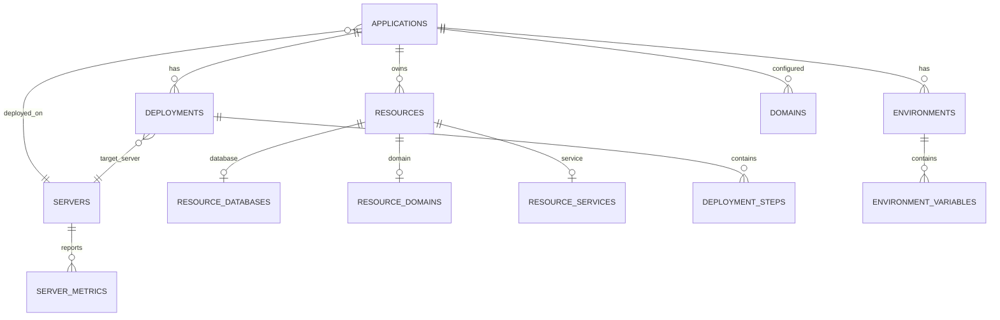

# PaaS Database Schema Design

> Database schema design for resource tracking, deployments, and configuration management based on Coolify patterns.

## Overview

This document defines the SQLite schema for the portable PaaS dashboard. The PaaS uses SQLite for its own internal state, while managing external PostgreSQL databases for applications.

### Design Rationale: SQLite vs PostgreSQL

| Aspect | SQLite (PaaS Internal) | PostgreSQL (Application Data) |
|--------|------------------------|-------------------------------|
| Deployment | Single file, no setup | Requires cluster setup |
| Portability | Copy file to migrate | Complex replication |
| Dependencies | None | Patroni + etcd + HAProxy |
| Backup | Copy file + export | pg_dump + WAL archiving |
| Use Case | PaaS configuration/state | Application user data |

**Key Principle:** The PaaS manages PostgreSQL clusters but uses SQLite for its own state to ensure maximum portability.

The schema supports:

- Application lifecycle management
- Multi-server deployments
- Domain and SSL tracking
- Environment variable management
- Deployment history and rollback
- Resource polymorphism
- Configuration export/import
- GitHub Gist sync state

## Entity Relationship Diagram



## Core Tables

### 1. Servers Table

Tracks all infrastructure servers.

```sql
CREATE TABLE servers (
    id TEXT PRIMARY KEY,  -- UUID as text
    name TEXT NOT NULL UNIQUE,
    hostname TEXT NOT NULL,
    tailscale_ip TEXT NOT NULL,
    public_ip TEXT,
    server_type TEXT NOT NULL,  -- 'router', 'app', 'database'
    location TEXT,  -- 'nyc', 'atl'
    
    -- Specs
    cpu_cores INTEGER,
    memory_gb INTEGER,
    disk_gb INTEGER,
    
    -- Status
    status TEXT DEFAULT 'active',
    last_seen_at TEXT,  -- ISO 8601 timestamp
    
    -- Metadata
    tags TEXT,  -- JSON array as text
    created_at TEXT DEFAULT (datetime('now')),
    updated_at TEXT DEFAULT (datetime('now'))
);

-- Index for IP lookups
CREATE INDEX idx_servers_tailscale_ip ON servers(tailscale_ip);
CREATE INDEX idx_servers_type ON servers(server_type);

-- Sample data
INSERT INTO servers (id, name, hostname, tailscale_ip, public_ip, server_type, location, cpu_cores, memory_gb, disk_gb) VALUES
('uuid-1', 'router-01', 'router-01.tailnet.ts.net', '100.102.220.16', '172.93.54.112', 'router', 'nyc', 2, 8, 160),
('uuid-2', 'router-02', 'router-02.tailnet.ts.net', '100.116.175.9', '23.29.118.6', 'router', 'atl', 2, 8, 160),
('uuid-3', 're-db', 're-db.tailnet.ts.net', '100.92.26.38', '208.87.128.115', 'app', 'nyc', 12, 48, 640),
('uuid-4', 're-node-02', 're-node-02.tailnet.ts.net', '100.89.130.19', '23.227.173.245', 'app', 'atl', 12, 48, 640),
('uuid-5', 're-node-01', 're-node-01.tailnet.ts.net', '100.126.103.51', '104.225.216.26', 'database', 'nyc', 8, 32, 320),
('uuid-6', 're-node-03', 're-node-03.tailnet.ts.net', '100.114.117.46', '172.93.54.145', 'database', 'nyc', 8, 32, 320),
('uuid-7', 're-node-04', 're-node-04.tailnet.ts.net', '100.115.75.119', '172.93.54.122', 'database', 'nyc', 8, 32, 320);
```

### 2. Applications Table

Central table for all deployed applications.

```sql
CREATE TABLE applications (
    id TEXT PRIMARY KEY,  -- UUID as text
    name TEXT NOT NULL UNIQUE,
    display_name TEXT,
    description TEXT,
    
    -- Git Configuration
    git_repo TEXT NOT NULL,
    git_branch_production TEXT DEFAULT 'main',
    git_branch_staging TEXT DEFAULT 'staging',
    webhook_secret_encrypted TEXT,
    
    -- Framework Detection
    framework TEXT NOT NULL,  -- 'laravel', 'nextjs', 'svelte', 'python', 'go'
    framework_version TEXT,
    build_command TEXT,
    start_command TEXT,
    migrate_command TEXT,
    
    -- Deployment Configuration
    deploy_strategy TEXT DEFAULT 'rolling',  -- 'rolling', 'blue-green', 'recreate'
    health_check_path TEXT DEFAULT '/',
    health_check_interval INTEGER DEFAULT 30,
    
    -- Port Allocation
    port_production INTEGER,
    port_staging INTEGER,
    
    -- Status
    status TEXT DEFAULT 'created',
    last_deploy_at TEXT,
    last_deploy_status TEXT,
    last_deploy_branch TEXT,
    last_deploy_environment TEXT,
    
    -- Flags
    staging_enabled INTEGER DEFAULT 1,  -- SQLite uses 0/1 for boolean
    auto_deploy_enabled INTEGER DEFAULT 1,
    
    -- Timestamps
    created_at TEXT DEFAULT (datetime('now')),
    updated_at TEXT DEFAULT (datetime('now'))
);

-- Indexes
CREATE INDEX idx_applications_name ON applications(name);
CREATE INDEX idx_applications_status ON applications(status);
CREATE INDEX idx_applications_framework ON applications(framework);

-- Port allocation tracked in separate table (no sequences in SQLite)
CREATE TABLE port_allocations (
    id INTEGER PRIMARY KEY AUTOINCREMENT,
    environment TEXT NOT NULL,  -- 'production' or 'staging'
    port INTEGER NOT NULL UNIQUE,
    app_id TEXT,
    allocated_at TEXT DEFAULT (datetime('now')),
    FOREIGN KEY (app_id) REFERENCES applications(id)
);

-- Pre-populate production ports (8100-8199)
INSERT INTO port_allocations (environment, port) 
SELECT 'production', 8100 + n FROM (
    WITH RECURSIVE cnt(x) AS (SELECT 0 UNION ALL SELECT x+1 FROM cnt WHERE x<99)
    SELECT x FROM cnt
);

-- Pre-populate staging ports (9200-9299)
INSERT INTO port_allocations (environment, port)
SELECT 'staging', 9200 + n FROM (
    WITH RECURSIVE cnt(x) AS (SELECT 0 UNION ALL SELECT x+1 FROM cnt WHERE x<99)
    SELECT x FROM cnt
);
```

### 3. Environments Table

Production and staging environments per application.

```sql
CREATE TABLE environments (
    id TEXT PRIMARY KEY,
    app_id TEXT NOT NULL REFERENCES applications(id) ON DELETE CASCADE,
    name TEXT NOT NULL,  -- 'production', 'staging'
    
    -- Branch mapping
    branch TEXT NOT NULL,
    
    -- Server allocation
    deploy_path TEXT NOT NULL,
    
    -- Status
    status TEXT DEFAULT 'inactive',
    current_commit TEXT,
    last_deploy_at TEXT,
    
    -- Timestamps
    created_at TEXT DEFAULT (datetime('now')),
    updated_at TEXT DEFAULT (datetime('now')),
    
    UNIQUE(app_id, name)
);
```

### 4. Environment Variables Table

Scoped secrets and configuration per environment.

```sql
CREATE TABLE environment_variables (
    id TEXT PRIMARY KEY,
    app_id TEXT NOT NULL REFERENCES applications(id) ON DELETE CASCADE,
    environment_id TEXT REFERENCES environments(id) ON DELETE CASCADE,
    
    -- Key-value
    key_name TEXT NOT NULL,
    value_encrypted TEXT NOT NULL,
    
    -- Scope
    scope TEXT NOT NULL,  -- 'shared', 'production', 'staging'
    
    -- Metadata
    is_sensitive INTEGER DEFAULT 1,
    source TEXT DEFAULT 'manual',  -- 'manual', 'import', 'generated'
    
    -- Timestamps
    created_at TEXT DEFAULT (datetime('now')),
    updated_at TEXT DEFAULT (datetime('now')),
    
    UNIQUE(app_id, key_name, scope)
);

-- Index for lookups
CREATE INDEX idx_env_vars_app ON environment_variables(app_id);
CREATE INDEX idx_env_vars_scope ON environment_variables(scope);
```

### 5. Domains Table

Domain configuration and SSL status.

```sql
CREATE TABLE domains (
    id TEXT PRIMARY KEY,
    app_id TEXT NOT NULL REFERENCES applications(id) ON DELETE CASCADE,
    environment_id TEXT REFERENCES environments(id) ON DELETE CASCADE,
    
    -- Domain
    domain_name TEXT NOT NULL UNIQUE,
    domain_type TEXT NOT NULL,  -- 'production', 'staging', 'www_redirect', 'cname'
    
    -- DNS
    cloudflare_zone_id TEXT,
    cloudflare_zone_name TEXT,
    dns_record_id TEXT,
    
    -- SSL
    ssl_enabled INTEGER DEFAULT 1,
    ssl_provider TEXT DEFAULT 'letsencrypt',
    ssl_status TEXT DEFAULT 'pending',  -- 'pending', 'provisioning', 'active', 'expired', 'failed'
    ssl_certificate_path TEXT,
    ssl_expires_at TEXT,
    
    -- Security
    waf_enabled INTEGER DEFAULT 1,
    auth_enabled INTEGER DEFAULT 0,
    auth_password_encrypted TEXT,
    
    -- Status
    status TEXT DEFAULT 'pending',
    provision_error TEXT,
    
    -- Timestamps
    created_at TEXT DEFAULT (datetime('now')),
    updated_at TEXT DEFAULT (datetime('now')),
    provisioned_at TEXT
);

-- Indexes
CREATE INDEX idx_domains_app ON domains(app_id);
CREATE INDEX idx_domains_name ON domains(domain_name);
CREATE INDEX idx_domains_ssl_status ON domains(ssl_status);
```

### 6. Deployments Table

Deployment history for rollback and auditing.

```sql
CREATE TABLE deployments (
    id TEXT PRIMARY KEY,
    app_id TEXT NOT NULL REFERENCES applications(id),
    environment_id TEXT NOT NULL REFERENCES environments(id),
    server_id TEXT NOT NULL REFERENCES servers(id),
    
    -- Git info
    commit_sha TEXT NOT NULL,
    commit_message TEXT,
    commit_author TEXT,
    branch TEXT NOT NULL,
    
    -- Trigger
    trigger_type TEXT NOT NULL,  -- 'webhook', 'manual', 'scheduled', 'rollback'
    triggered_by TEXT,  -- username or 'github-webhook'
    
    -- Status
    status TEXT DEFAULT 'pending',  -- 'pending', 'running', 'success', 'failed', 'rolled_back'
    started_at TEXT,
    completed_at TEXT,
    duration_seconds INTEGER,
    
    -- Results
    health_check_passed INTEGER,
    health_check_response TEXT,
    error_message TEXT,
    error_output TEXT,
    
    -- Rollback info
    previous_deployment_id TEXT REFERENCES deployments(id),
    rolled_back_by TEXT REFERENCES deployments(id),
    
    -- Timestamps
    created_at TEXT DEFAULT (datetime('now'))
);

-- Indexes
CREATE INDEX idx_deployments_app ON deployments(app_id);
CREATE INDEX idx_deployments_status ON deployments(status);
CREATE INDEX idx_deployments_created ON deployments(created_at DESC);
```

### 7. Deployment Steps Table

Granular deployment progress tracking.

```sql
CREATE TABLE deployment_steps (
    id TEXT PRIMARY KEY,
    deployment_id TEXT NOT NULL REFERENCES deployments(id) ON DELETE CASCADE,
    
    -- Step info
    step_number INTEGER NOT NULL,
    step_name TEXT NOT NULL,  -- 'git_pull', 'install_deps', 'migrate', 'restart', 'health_check'
    
    -- Status
    status TEXT DEFAULT 'pending',  -- 'pending', 'running', 'success', 'failed', 'skipped'
    started_at TEXT,
    completed_at TEXT,
    duration_ms INTEGER,
    
    -- Output
    output TEXT,
    error TEXT,
    
    -- Timestamps
    created_at TEXT DEFAULT (datetime('now')),
    
    UNIQUE(deployment_id, step_number)
);

-- Index for real-time progress
CREATE INDEX idx_deploy_steps_deployment ON deployment_steps(deployment_id);
```

## Resource Tables (Polymorphic)

### Base Resources Table

```sql
CREATE TABLE resources (
    id TEXT PRIMARY KEY,
    app_id TEXT NOT NULL REFERENCES applications(id) ON DELETE CASCADE,
    environment_id TEXT REFERENCES environments(id) ON DELETE CASCADE,
    
    -- Type discrimination
    type TEXT NOT NULL,  -- 'database', 'redis', 'volume', 'service'
    name TEXT NOT NULL,
    
    -- Common fields
    status TEXT DEFAULT 'pending',
    config TEXT DEFAULT '{}',  -- JSON as text
    
    -- Timestamps
    created_at TEXT DEFAULT (datetime('now')),
    updated_at TEXT DEFAULT (datetime('now'))
);

CREATE INDEX idx_resources_app ON resources(app_id);
CREATE INDEX idx_resources_type ON resources(type);
```

### Database Resources Table

```sql
CREATE TABLE resource_databases (
    resource_id TEXT PRIMARY KEY REFERENCES resources(id) ON DELETE CASCADE,
    
    -- Connection
    db_name TEXT NOT NULL,
    db_host TEXT DEFAULT '100.102.220.16',
    db_port INTEGER DEFAULT 5000,
    
    -- Credentials (encrypted)
    db_user TEXT NOT NULL,
    db_password_encrypted TEXT NOT NULL,
    db_admin_user TEXT,
    db_admin_password_encrypted TEXT,
    
    -- Size tracking
    db_size_mb INTEGER,
    db_size_updated_at TEXT,
    
    -- Connection pooling
    pool_size INTEGER DEFAULT 20,
    pool_mode TEXT DEFAULT 'transaction'
);

CREATE INDEX idx_resource_dbs_name ON resource_databases(db_name);
```

### Service Resources Table

```sql
CREATE TABLE resource_services (
    resource_id TEXT PRIMARY KEY REFERENCES resources(id) ON DELETE CASCADE,
    
    -- Service type
    service_type TEXT NOT NULL,  -- 'nginx', 'php-fpm', 'nodejs', 'systemd'
    
    -- Configuration
    port INTEGER,
    process_count INTEGER,
    memory_limit_mb INTEGER,
    
    -- Config paths
    config_path TEXT,
    log_path TEXT,
    
    -- Status
    is_running INTEGER DEFAULT 0,
    pid INTEGER,
    
    -- Metrics
    cpu_percent REAL,
    memory_mb INTEGER
);
```

## Server Metrics Table

```sql
CREATE TABLE server_metrics (
    id TEXT PRIMARY KEY,
    server_id TEXT NOT NULL REFERENCES servers(id) ON DELETE CASCADE,
    
    -- Timestamp
    recorded_at TEXT DEFAULT (datetime('now')),
    
    -- CPU
    cpu_percent REAL,
    cpu_load_1m REAL,
    cpu_load_5m REAL,
    cpu_load_15m REAL,
    
    -- Memory
    memory_total_mb INTEGER,
    memory_used_mb INTEGER,
    memory_available_mb INTEGER,
    memory_percent REAL,
    
    -- Disk
    disk_total_gb REAL,
    disk_used_gb REAL,
    disk_available_gb REAL,
    disk_percent REAL,
    
    -- Network
    network_rx_bytes INTEGER,
    network_tx_bytes INTEGER
);

CREATE INDEX idx_metrics_server_time ON server_metrics(server_id, recorded_at DESC);

-- Retention: Keep 90 days of metrics
-- Implement via scheduled job: DELETE FROM server_metrics WHERE datetime(recorded_at) < datetime('now', '-90 days')
```

## Configuration Export/Import Tables

### Export History Table

Track all configuration exports for audit and rollback.

```sql
CREATE TABLE config_exports (
    id TEXT PRIMARY KEY,
    export_type TEXT NOT NULL,  -- 'manual', 'auto', 'gist_sync'
    file_path TEXT,  -- Local file path if saved
    gist_version TEXT,  -- Gist version ID if synced
    checksum TEXT NOT NULL,  -- SHA-256 of export content
    size_bytes INTEGER,
    includes_secrets INTEGER DEFAULT 1,
    
    -- Content summary
    apps_count INTEGER,
    domains_count INTEGER,
    secrets_count INTEGER,
    
    -- Timestamps
    created_at TEXT DEFAULT (datetime('now'))
);

CREATE INDEX idx_exports_created ON config_exports(created_at DESC);
CREATE INDEX idx_exports_type ON config_exports(export_type);
```

### Import History Table

Track all configuration imports with validation results.

```sql
CREATE TABLE config_imports (
    id TEXT PRIMARY KEY,
    source TEXT NOT NULL,  -- 'file', 'gist', 'upload'
    source_path TEXT,  -- File path or gist ID
    import_mode TEXT NOT NULL,  -- 'merge', 'replace', 'validate'
    
    -- Validation results
    validation_passed INTEGER DEFAULT 0,
    validation_errors TEXT,  -- JSON array of errors
    
    -- Import results
    import_status TEXT DEFAULT 'pending',  -- 'pending', 'running', 'success', 'failed'
    apps_imported INTEGER DEFAULT 0,
    apps_updated INTEGER DEFAULT 0,
    apps_skipped INTEGER DEFAULT 0,
    domains_imported INTEGER DEFAULT 0,
    secrets_imported INTEGER DEFAULT 0,
    
    error_message TEXT,
    
    -- Timestamps
    started_at TEXT,
    completed_at TEXT,
    created_at TEXT DEFAULT (datetime('now'))
);

CREATE INDEX idx_imports_created ON config_imports(created_at DESC);
CREATE INDEX idx_imports_status ON config_imports(import_status);
```

### Gist Sync State Table

Track GitHub Gist synchronization state.

```sql
CREATE TABLE gist_sync_state (
    id INTEGER PRIMARY KEY CHECK (id = 1),  -- Singleton row
    gist_id TEXT,  -- GitHub Gist ID
    gist_url TEXT,  -- Full Gist URL
    gist_version TEXT,  -- Current Gist version/revision
    last_sync_at TEXT,  -- Last successful sync timestamp
    last_sync_status TEXT,  -- 'success', 'failed', 'pending'
    last_sync_error TEXT,
    sync_enabled INTEGER DEFAULT 1,
    
    -- Statistics
    total_syncs INTEGER DEFAULT 0,
    failed_syncs INTEGER DEFAULT 0,
    
    -- Configuration
    auto_sync_enabled INTEGER DEFAULT 1,
    sync_interval_seconds INTEGER DEFAULT 300,  -- 5 minutes
    
    updated_at TEXT DEFAULT (datetime('now'))
);

-- Initialize singleton row
INSERT INTO gist_sync_state (id, sync_enabled, auto_sync_enabled) VALUES (1, 0, 1);
```

### Sync Events Table

Detailed log of sync events for debugging.

```sql
CREATE TABLE gist_sync_events (
    id TEXT PRIMARY KEY,
    sync_type TEXT NOT NULL,  -- 'export', 'import', 'auto', 'manual'
    direction TEXT NOT NULL,  -- 'push', 'pull'
    
    -- Trigger info
    trigger_source TEXT,  -- 'config_change', 'manual', 'scheduled'
    trigger_entity TEXT,  -- 'app:rentalfixer', 'domain:example.com'
    
    -- Results
    status TEXT NOT NULL,  -- 'success', 'failed', 'partial'
    gist_version_before TEXT,
    gist_version_after TEXT,
    changes_count INTEGER DEFAULT 0,
    
    error_message TEXT,
    error_details TEXT,
    
    -- Timing
    duration_ms INTEGER,
    created_at TEXT DEFAULT (datetime('now'))
);

CREATE INDEX idx_sync_events_created ON gist_sync_events(created_at DESC);
CREATE INDEX idx_sync_events_status ON gist_sync_events(status);
```

## Utility Views

### Get Last Successful Deployment

```sql
CREATE VIEW last_successful_deployments AS
SELECT 
    d.app_id,
    d.environment_id,
    d.id AS deployment_id,
    d.commit_sha,
    d.created_at
FROM deployments d
WHERE d.status = 'success'
AND d.created_at = (
    SELECT MAX(d2.created_at)
    FROM deployments d2
    WHERE d2.app_id = d.app_id
    AND d2.environment_id = d.environment_id
    AND d2.status = 'success'
);
```

### Active Applications Summary

```sql
CREATE VIEW active_applications AS
SELECT 
    a.id,
    a.name,
    a.display_name,
    a.framework,
    a.status,
    a.last_deploy_at,
    a.last_deploy_status,
    a.last_deploy_branch,
    a.last_deploy_environment,
    COUNT(DISTINCT d.id) AS domain_count,
    COUNT(DISTINCT dep.id) AS deployment_count
FROM applications a
LEFT JOIN domains d ON a.id = d.app_id
LEFT JOIN deployments dep ON a.id = dep.app_id
GROUP BY a.id;
```

### Expiring SSL Certificates

```sql
CREATE VIEW expiring_ssl_certificates AS
SELECT 
    d.id,
    d.domain_name,
    a.name AS app_name,
    d.ssl_expires_at,
    CAST(julianday(d.ssl_expires_at) - julianday('now') AS INTEGER) AS days_remaining
FROM domains d
JOIN applications a ON d.app_id = a.id
WHERE d.ssl_status = 'active'
AND d.ssl_expires_at IS NOT NULL
AND julianday(d.ssl_expires_at) < julianday('now', '+30 days')
ORDER BY d.ssl_expires_at ASC;
```

## Migration from YAML Files

The current implementation uses YAML files for configuration. To migrate to SQLite:

### Migration Script

```python
# scripts/migrate_yaml_to_sqlite.py
import yaml
import json
import sqlite3
import uuid
from datetime import datetime

def generate_uuid():
    return str(uuid.uuid4())

def migrate_applications(db_path: str, yaml_path: str):
    """Migrate applications.yml to SQLite database."""
    with open(yaml_path) as f:
        apps = yaml.safe_load(f)
    
    conn = sqlite3.connect(db_path)
    conn.row_factory = sqlite3.Row
    
    with conn:
        for app_name, app_config in apps.items():
            app_id = generate_uuid()
            
            # Insert application
            conn.execute("""
                INSERT INTO applications (
                    id, name, display_name, description, git_repo, framework,
                    git_branch_production, git_branch_staging,
                    port_production, port_staging, staging_enabled,
                    created_at, updated_at
                ) VALUES (?, ?, ?, ?, ?, ?, ?, ?, ?, ?, ?, ?, ?)
            """, (
                app_id,
                app_name,
                app_config.get('display_name', app_name),
                app_config.get('description', ''),
                app_config['git_repo'],
                app_config.get('framework', 'laravel'),
                app_config.get('production_branch', 'main'),
                app_config.get('staging_branch', 'staging'),
                app_config.get('port_production'),
                app_config.get('port_staging'),
                1 if app_config.get('staging_enabled', True) else 0,
                datetime.utcnow().isoformat(),
                datetime.utcnow().isoformat()
            ))
            
            # Insert production environment
            env_id = generate_uuid()
            conn.execute("""
                INSERT INTO environments (id, app_id, name, branch, deploy_path, status)
                VALUES (?, ?, 'production', ?, ?, 'active')
            """, (
                env_id,
                app_id,
                app_config.get('production_branch', 'main'),
                f'/opt/apps/{app_name}'
            ))
            
            # Insert staging environment if enabled
            if app_config.get('staging_enabled', True):
                staging_env_id = generate_uuid()
                conn.execute("""
                    INSERT INTO environments (id, app_id, name, branch, deploy_path, status)
                    VALUES (?, ?, 'staging', ?, ?, 'active')
                """, (
                    staging_env_id,
                    app_id,
                    app_config.get('staging_branch', 'staging'),
                    f'/opt/apps/{app_name}-staging'
                ))
            
            # Insert domains
            for domain in app_config.get('domains', []):
                domain_id = generate_uuid()
                conn.execute("""
                    INSERT INTO domains (
                        id, app_id, domain_name, domain_type, ssl_status,
                        auth_enabled, auth_password_encrypted, status
                    ) VALUES (?, ?, ?, ?, ?, ?, ?, ?)
                """, (
                    domain_id,
                    app_id,
                    domain['domain'],
                    domain.get('type', 'production'),
                    domain.get('ssl_status', 'active'),
                    1 if domain.get('type') == 'staging' else 0,
                    domain.get('password'),
                    'active'
                ))
    
    conn.close()
    print(f"Migration complete: {len(apps)} applications migrated")

def migrate_databases(db_path: str, yaml_path: str):
    """Migrate databases.yml to SQLite database."""
    with open(yaml_path) as f:
        databases = yaml.safe_load(f)
    
    conn = sqlite3.connect(db_path)
    
    with conn:
        for db_name, db_config in databases.items():
            # Insert as resource
            resource_id = generate_uuid()
            # Note: You'll need the app_id - this is simplified
            
    conn.close()

if __name__ == '__main__':
    import os
    
    db_path = os.environ.get('SQLITE_DB_PATH', '/data/paas.db')
    
    migrate_applications(db_path, '/opt/dashboard/config/applications.yml')
    migrate_databases(db_path, '/opt/dashboard/config/databases.yml')
```

## Backup Strategy

### SQLite Database Backup

```bash
#!/bin/bash
# /opt/scripts/backup-paas-sqlite.sh

SQLITE_DB="${SQLITE_DB_PATH:-/data/paas.db}"
BACKUP_DIR="/data/backups"
TIMESTAMP=$(date +%Y%m%d_%H%M%S)
BACKUP_FILE="$BACKUP_DIR/paas_$TIMESTAMP.db"

mkdir -p "$BACKUP_DIR"

# SQLite backup (creates consistent copy)
sqlite3 "$SQLITE_DB" ".backup '$BACKUP_FILE'"

# Compress
gzip "$BACKUP_FILE"

# Upload to S3 (optional)
# aws s3 cp "$BACKUP_FILE.gz" "s3://quantyra-backups/paas/"

# Cleanup old backups (keep 30 days)
find "$BACKUP_DIR" -name "paas_*.db.gz" -mtime +30 -delete

echo "Backup completed: $BACKUP_FILE.gz"
```

### Export-Based Backup

The configuration export provides an additional backup layer:

```bash
# Manual export
curl -X POST http://localhost:8080/api/config/export -o config_backup.json

# Import to restore
curl -X POST http://localhost:8080/api/config/import \
  -H "Content-Type: application/json" \
  -d @config_backup.json
```

## Index Optimization

### Recommended Indexes

```sql
-- For dashboard application list queries
CREATE INDEX idx_apps_list ON applications(status, created_at DESC);

-- For deployment history queries
CREATE INDEX idx_deployments_history ON deployments(app_id, created_at DESC);

-- For domain status queries
CREATE INDEX idx_domains_status ON domains(ssl_status, status);

-- For environment variable lookups
CREATE INDEX idx_env_vars_lookup ON environment_variables(app_id, scope);

-- For metrics aggregation
CREATE INDEX idx_metrics_aggregate ON server_metrics(server_id, recorded_at);

-- For config export queries
CREATE INDEX idx_exports_checksum ON config_exports(checksum);
```

## SQLite-Specific Considerations

### WAL Mode

Enable Write-Ahead Logging for better concurrency:

```sql
PRAGMA journal_mode=WAL;
PRAGMA synchronous=NORMAL;
PRAGMA cache_size=-64000;  -- 64MB cache
PRAGMA busy_timeout=5000;  -- 5 second timeout
```

### Database File Location

| Path | Purpose |
|------|---------|
| `/data/paas.db` | Main database file |
| `/data/paas.db-wal` | Write-ahead log |
| `/data/paas.db-shm` | Shared memory file |
| `/data/backups/` | Automated backups |

### Foreign Keys

SQLite doesn't enforce foreign keys by default:

```sql
PRAGMA foreign_keys=ON;
```

Include this in connection setup:

```python
conn = sqlite3.connect(db_path)
conn.execute("PRAGMA foreign_keys=ON")
```

## Next Steps

1. Create SQLite database: `sqlite3 /data/paas.db < schema.sql`
2. Enable WAL mode and foreign keys
3. Migrate data from YAML files
4. Update dashboard to use SQLite instead of YAML
5. Implement config export/import API
6. Set up GitHub Gist sync
7. Add automated backup

See [paas_backend_patterns.md](paas_backend_patterns.md) for Python SQLite implementation.