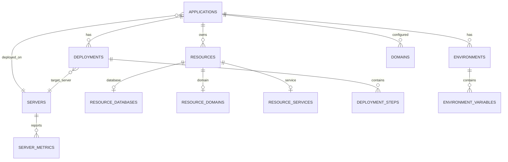

# PaaS Database Schema Design

> Database schema design for resource tracking, deployments, and configuration management based on Coolify patterns.

## Overview

This document defines the PostgreSQL schema for the enhanced PaaS dashboard. The schema supports:

- Application lifecycle management
- Multi-server deployments
- Domain and SSL tracking
- Environment variable management
- Deployment history and rollback
- Resource polymorphism

## Entity Relationship Diagram



## Core Tables

### 1. Servers Table

Tracks all infrastructure servers.

```sql
CREATE TABLE servers (
    id UUID PRIMARY KEY DEFAULT gen_random_uuid(),
    name VARCHAR(100) NOT NULL UNIQUE,
    hostname VARCHAR(255) NOT NULL,
    tailscale_ip INET NOT NULL,
    public_ip INET,
    server_type VARCHAR(50) NOT NULL, -- 'router', 'app', 'database'
    location VARCHAR(50), -- 'nyc', 'atl'
    
    -- Specs
    cpu_cores INTEGER,
    memory_gb INTEGER,
    disk_gb INTEGER,
    
    -- Status
    status VARCHAR(50) DEFAULT 'active',
    last_seen_at TIMESTAMP,
    
    -- Metadata
    tags TEXT[],
    created_at TIMESTAMP DEFAULT NOW(),
    updated_at TIMESTAMP DEFAULT NOW()
);

-- Index for IP lookups
CREATE INDEX idx_servers_tailscale_ip ON servers(tailscale_ip);
CREATE INDEX idx_servers_type ON servers(server_type);

-- Sample data
INSERT INTO servers (name, hostname, tailscale_ip, public_ip, server_type, location, cpu_cores, memory_gb, disk_gb) VALUES
('router-01', 'router-01.tailnet.ts.net', '100.102.220.16', '172.93.54.112', 'router', 'nyc', 2, 8, 160),
('router-02', 'router-02.tailnet.ts.net', '100.116.175.9', '23.29.118.6', 'router', 'atl', 2, 8, 160),
('re-db', 're-db.tailnet.ts.net', '100.92.26.38', '208.87.128.115', 'app', 'nyc', 12, 48, 640),
('re-node-02', 're-node-02.tailnet.ts.net', '100.89.130.19', '23.227.173.245', 'app', 'atl', 12, 48, 640),
('re-node-01', 're-node-01.tailnet.ts.net', '100.126.103.51', '104.225.216.26', 'database', 'nyc', 8, 32, 320),
('re-node-03', 're-node-03.tailnet.ts.net', '100.114.117.46', '172.93.54.145', 'database', 'nyc', 8, 32, 320),
('re-node-04', 're-node-04.tailnet.ts.net', '100.115.75.119', '172.93.54.122', 'database', 'nyc', 8, 32, 320);
```

### 2. Applications Table

Central table for all deployed applications.

```sql
CREATE TABLE applications (
    id UUID PRIMARY KEY DEFAULT gen_random_uuid(),
    name VARCHAR(100) NOT NULL UNIQUE,
    display_name VARCHAR(255),
    description TEXT,
    
    -- Git Configuration
    git_repo VARCHAR(500) NOT NULL,
    git_branch_production VARCHAR(100) DEFAULT 'main',
    git_branch_staging VARCHAR(100) DEFAULT 'staging',
    webhook_secret_encrypted TEXT,
    
    -- Framework Detection
    framework VARCHAR(50) NOT NULL, -- 'laravel', 'nextjs', 'svelte', 'python', 'go'
    framework_version VARCHAR(20),
    build_command TEXT,
    start_command TEXT,
    migrate_command TEXT,
    
    -- Deployment Configuration
    deploy_strategy VARCHAR(50) DEFAULT 'rolling', -- 'rolling', 'blue-green', 'recreate'
    health_check_path VARCHAR(255) DEFAULT '/',
    health_check_interval INTEGER DEFAULT 30,
    
    -- Port Allocation
    port_production INTEGER,
    port_staging INTEGER,
    
    -- Status
    status VARCHAR(50) DEFAULT 'created',
    last_deploy_at TIMESTAMP,
    last_deploy_status VARCHAR(50),
    last_deploy_branch VARCHAR(100),
    last_deploy_environment VARCHAR(50),
    
    -- Flags
    staging_enabled BOOLEAN DEFAULT TRUE,
    auto_deploy_enabled BOOLEAN DEFAULT TRUE,
    
    -- Timestamps
    created_at TIMESTAMP DEFAULT NOW(),
    updated_at TIMESTAMP DEFAULT NOW()
);

-- Indexes
CREATE INDEX idx_applications_name ON applications(name);
CREATE INDEX idx_applications_status ON applications(status);
CREATE INDEX idx_applications_framework ON applications(framework);

-- Port allocation sequence
CREATE SEQUENCE app_port_production START 8100;
CREATE SEQUENCE app_port_staging START 9200;
```

### 3. Environments Table

Production and staging environments per application.

```sql
CREATE TABLE environments (
    id UUID PRIMARY KEY DEFAULT gen_random_uuid(),
    app_id UUID NOT NULL REFERENCES applications(id) ON DELETE CASCADE,
    name VARCHAR(50) NOT NULL, -- 'production', 'staging'
    
    -- Branch mapping
    branch VARCHAR(100) NOT NULL,
    
    -- Server allocation
    deploy_path VARCHAR(255) NOT NULL,
    
    -- Status
    status VARCHAR(50) DEFAULT 'inactive',
    current_commit VARCHAR(40),
    last_deploy_at TIMESTAMP,
    
    -- Timestamps
    created_at TIMESTAMP DEFAULT NOW(),
    updated_at TIMESTAMP DEFAULT NOW(),
    
    UNIQUE(app_id, name)
);

-- Default environments for each app
-- production: main branch, /opt/apps/{app_name}
-- staging: staging branch, /opt/apps/{app_name}-staging
```

### 4. Environment Variables Table

Scoped secrets and configuration per environment.

```sql
CREATE TABLE environment_variables (
    id UUID PRIMARY KEY DEFAULT gen_random_uuid(),
    app_id UUID NOT NULL REFERENCES applications(id) ON DELETE CASCADE,
    environment_id UUID REFERENCES environments(id) ON DELETE CASCADE,
    
    -- Key-value
    key_name VARCHAR(255) NOT NULL,
    value_encrypted TEXT NOT NULL,
    
    -- Scope
    scope VARCHAR(50) NOT NULL, -- 'shared', 'production', 'staging'
    
    -- Metadata
    is_sensitive BOOLEAN DEFAULT TRUE,
    source VARCHAR(50) DEFAULT 'manual', -- 'manual', 'import', 'generated'
    
    -- Timestamps
    created_at TIMESTAMP DEFAULT NOW(),
    updated_at TIMESTAMP DEFAULT NOW(),
    
    UNIQUE(app_id, key_name, scope)
);

-- Index for lookups
CREATE INDEX idx_env_vars_app ON environment_variables(app_id);
CREATE INDEX idx_env_vars_scope ON environment_variables(scope);
```

### 5. Domains Table

Domain configuration and SSL status.

```sql
CREATE TABLE domains (
    id UUID PRIMARY KEY DEFAULT gen_random_uuid(),
    app_id UUID NOT NULL REFERENCES applications(id) ON DELETE CASCADE,
    environment_id UUID REFERENCES environments(id) ON DELETE CASCADE,
    
    -- Domain
    domain_name VARCHAR(255) NOT NULL UNIQUE,
    domain_type VARCHAR(50) NOT NULL, -- 'production', 'staging', 'www_redirect', 'cname'
    
    -- DNS
    cloudflare_zone_id VARCHAR(100),
    cloudflare_zone_name VARCHAR(255),
    dns_record_id VARCHAR(100),
    
    -- SSL
    ssl_enabled BOOLEAN DEFAULT TRUE,
    ssl_provider VARCHAR(50) DEFAULT 'letsencrypt',
    ssl_status VARCHAR(50) DEFAULT 'pending', -- 'pending', 'provisioning', 'active', 'expired', 'failed'
    ssl_certificate_path VARCHAR(500),
    ssl_expires_at TIMESTAMP,
    
    -- Security
    waf_enabled BOOLEAN DEFAULT TRUE,
    auth_enabled BOOLEAN DEFAULT FALSE,
    auth_password_encrypted TEXT,
    
    -- Status
    status VARCHAR(50) DEFAULT 'pending',
    provision_error TEXT,
    
    -- Timestamps
    created_at TIMESTAMP DEFAULT NOW(),
    updated_at TIMESTAMP DEFAULT NOW(),
    provisioned_at TIMESTAMP
);

-- Indexes
CREATE INDEX idx_domains_app ON domains(app_id);
CREATE INDEX idx_domains_name ON domains(domain_name);
CREATE INDEX idx_domains_ssl_status ON domains(ssl_status);
```

### 6. Deployments Table

Deployment history for rollback and auditing.

```sql
CREATE TABLE deployments (
    id UUID PRIMARY KEY DEFAULT gen_random_uuid(),
    app_id UUID NOT NULL REFERENCES applications(id),
    environment_id UUID NOT NULL REFERENCES environments(id),
    server_id UUID NOT NULL REFERENCES servers(id),
    
    -- Git info
    commit_sha VARCHAR(40) NOT NULL,
    commit_message TEXT,
    commit_author VARCHAR(255),
    branch VARCHAR(100) NOT NULL,
    
    -- Trigger
    trigger_type VARCHAR(50) NOT NULL, -- 'webhook', 'manual', 'scheduled', 'rollback'
    triggered_by VARCHAR(255), -- username or 'github-webhook'
    
    -- Status
    status VARCHAR(50) DEFAULT 'pending', -- 'pending', 'running', 'success', 'failed', 'rolled_back'
    started_at TIMESTAMP,
    completed_at TIMESTAMP,
    duration_seconds INTEGER,
    
    -- Results
    health_check_passed BOOLEAN,
    health_check_response TEXT,
    error_message TEXT,
    error_output TEXT,
    
    -- Rollback info
    previous_deployment_id UUID REFERENCES deployments(id),
    rolled_back_by UUID REFERENCES deployments(id),
    
    -- Timestamps
    created_at TIMESTAMP DEFAULT NOW()
);

-- Indexes
CREATE INDEX idx_deployments_app ON deployments(app_id);
CREATE INDEX idx_deployments_status ON deployments(status);
CREATE INDEX idx_deployments_created ON deployments(created_at DESC);

-- For finding last successful deploy
CREATE INDEX idx_deployments_success ON deployments(app_id, environment_id, status, created_at DESC) 
    WHERE status = 'success';
```

### 7. Deployment Steps Table

Granular deployment progress tracking.

```sql
CREATE TABLE deployment_steps (
    id UUID PRIMARY KEY DEFAULT gen_random_uuid(),
    deployment_id UUID NOT NULL REFERENCES deployments(id) ON DELETE CASCADE,
    
    -- Step info
    step_number INTEGER NOT NULL,
    step_name VARCHAR(100) NOT NULL, -- 'git_pull', 'install_deps', 'migrate', 'restart', 'health_check'
    
    -- Status
    status VARCHAR(50) DEFAULT 'pending', -- 'pending', 'running', 'success', 'failed', 'skipped'
    started_at TIMESTAMP,
    completed_at TIMESTAMP,
    duration_ms INTEGER,
    
    -- Output
    output TEXT,
    error TEXT,
    
    -- Timestamps
    created_at TIMESTAMP DEFAULT NOW(),
    
    UNIQUE(deployment_id, step_number)
);

-- Index for real-time progress
CREATE INDEX idx_deploy_steps_deployment ON deployment_steps(deployment_id);
```

## Resource Tables (Polymorphic)

### Base Resources Table

```sql
CREATE TABLE resources (
    id UUID PRIMARY KEY DEFAULT gen_random_uuid(),
    app_id UUID NOT NULL REFERENCES applications(id) ON DELETE CASCADE,
    environment_id UUID REFERENCES environments(id) ON DELETE CASCADE,
    
    -- Type discrimination
    type VARCHAR(50) NOT NULL, -- 'database', 'redis', 'volume', 'service'
    name VARCHAR(255) NOT NULL,
    
    -- Common fields
    status VARCHAR(50) DEFAULT 'pending',
    config JSONB DEFAULT '{}',
    
    -- Timestamps
    created_at TIMESTAMP DEFAULT NOW(),
    updated_at TIMESTAMP DEFAULT NOW()
);

CREATE INDEX idx_resources_app ON resources(app_id);
CREATE INDEX idx_resources_type ON resources(type);
```

### Database Resources Table

```sql
CREATE TABLE resource_databases (
    resource_id UUID PRIMARY KEY REFERENCES resources(id) ON DELETE CASCADE,
    
    -- Connection
    db_name VARCHAR(100) NOT NULL,
    db_host VARCHAR(255) DEFAULT '100.102.220.16',
    db_port INTEGER DEFAULT 5000,
    
    -- Credentials (encrypted)
    db_user VARCHAR(100) NOT NULL,
    db_password_encrypted TEXT NOT NULL,
    db_admin_user VARCHAR(100),
    db_admin_password_encrypted TEXT,
    
    -- Size tracking
    db_size_mb INTEGER,
    db_size_updated_at TIMESTAMP,
    
    -- Connection pooling
    pool_size INTEGER DEFAULT 20,
    pool_mode VARCHAR(50) DEFAULT 'transaction'
);

CREATE INDEX idx_resource_dbs_name ON resource_databases(db_name);
```

### Service Resources Table

```sql
CREATE TABLE resource_services (
    resource_id UUID PRIMARY KEY REFERENCES resources(id) ON DELETE CASCADE,
    
    -- Service type
    service_type VARCHAR(50) NOT NULL, -- 'nginx', 'php-fpm', 'nodejs', 'systemd'
    
    -- Configuration
    port INTEGER,
    process_count INTEGER,
    memory_limit_mb INTEGER,
    
    -- Config paths
    config_path VARCHAR(500),
    log_path VARCHAR(500),
    
    -- Status
    is_running BOOLEAN DEFAULT FALSE,
    pid INTEGER,
    
    -- Metrics
    cpu_percent DECIMAL(5,2),
    memory_mb INTEGER
);
```

## Server Metrics Table

```sql
CREATE TABLE server_metrics (
    id UUID PRIMARY KEY DEFAULT gen_random_uuid(),
    server_id UUID NOT NULL REFERENCES servers(id) ON DELETE CASCADE,
    
    -- Timestamp
    recorded_at TIMESTAMP DEFAULT NOW(),
    
    -- CPU
    cpu_percent DECIMAL(5,2),
    cpu_load_1m DECIMAL(5,2),
    cpu_load_5m DECIMAL(5,2),
    cpu_load_15m DECIMAL(5,2),
    
    -- Memory
    memory_total_mb INTEGER,
    memory_used_mb INTEGER,
    memory_available_mb INTEGER,
    memory_percent DECIMAL(5,2),
    
    -- Disk
    disk_total_gb DECIMAL(10,2),
    disk_used_gb DECIMAL(10,2),
    disk_available_gb DECIMAL(10,2),
    disk_percent DECIMAL(5,2),
    
    -- Network
    network_rx_bytes BIGINT,
    network_tx_bytes BIGINT
);

-- Partitioning for performance (optional)
-- CREATE INDEX idx_metrics_server_time ON server_metrics(server_id, recorded_at DESC);

-- Retention: Keep 90 days of metrics
-- Implement via scheduled job: DELETE FROM server_metrics WHERE recorded_at < NOW() - INTERVAL '90 days'
```

## Utility Functions

### Get Last Successful Deployment

```sql
CREATE OR REPLACE FUNCTION get_last_successful_deploy(
    p_app_id UUID,
    p_environment_id UUID
) RETURNS UUID AS $$
BEGIN
    RETURN (
        SELECT id FROM deployments
        WHERE app_id = p_app_id
          AND environment_id = p_environment_id
          AND status = 'success'
        ORDER BY created_at DESC
        LIMIT 1
    );
END;
$$ LANGUAGE plpgsql;
```

### Allocate Next Port

```sql
CREATE OR REPLACE FUNCTION allocate_app_ports(
    p_app_name VARCHAR
) RETURNS TABLE(production_port INTEGER, staging_port INTEGER) AS $$
DECLARE
    v_prod_port INTEGER;
    v_staging_port INTEGER;
BEGIN
    -- Get next production port
    SELECT nextval('app_port_production') INTO v_prod_port;
    
    -- Get next staging port
    SELECT nextval('app_port_staging') INTO v_staging_port;
    
    RETURN QUERY SELECT v_prod_port, v_staging_port;
END;
$$ LANGUAGE plpgsql;
```

### Check SSL Expiration

```sql
CREATE OR REPLACE FUNCTION get_expiring_ssl_certificates(
    p_days_threshold INTEGER DEFAULT 30
) RETURNS TABLE(
    domain_id UUID,
    domain_name VARCHAR,
    app_name VARCHAR,
    expires_at TIMESTAMP,
    days_remaining INTEGER
) AS $$
BEGIN
    RETURN QUERY
    SELECT 
        d.id,
        d.domain_name,
        a.name,
        d.ssl_expires_at,
        EXTRACT(DAY FROM d.ssl_expires_at - NOW())::INTEGER
    FROM domains d
    JOIN applications a ON d.app_id = a.id
    WHERE d.ssl_status = 'active'
      AND d.ssl_expires_at IS NOT NULL
      AND d.ssl_expires_at < NOW() + (p_days_threshold || ' days')::INTERVAL
    ORDER BY d.ssl_expires_at;
END;
$$ LANGUAGE plpgsql;
```

## Migration from YAML Files

The current implementation uses YAML files for configuration. To migrate:

### Migration Script

```python
# scripts/migrate_yaml_to_db.py
import yaml
import json
from datetime import datetime
import psycopg2

def migrate_applications(conn, yaml_path: str):
    """Migrate applications.yml to database."""
    with open(yaml_path) as f:
        apps = yaml.safe_load(f)
    
    with conn.cursor() as cur:
        for app_name, app_config in apps.items():
            # Insert application
            cur.execute("""
                INSERT INTO applications (
                    name, display_name, description, git_repo, framework,
                    git_branch_production, git_branch_staging,
                    port_production, port_staging, staging_enabled,
                    created_at, updated_at
                ) VALUES (%s, %s, %s, %s, %s, %s, %s, %s, %s, %s, %s, %s)
                RETURNING id
            """, (
                app_name,
                app_config.get('display_name', app_name),
                app_config.get('description', ''),
                app_config['git_repo'],
                app_config.get('framework', 'laravel'),
                app_config.get('production_branch', 'main'),
                app_config.get('staging_branch', 'staging'),
                app_config.get('port_production'),
                app_config.get('port_staging'),
                app_config.get('staging_enabled', True),
                datetime.now(),
                datetime.now()
            ))
            
            app_id = cur.fetchone()[0]
            
            # Insert environments
            cur.execute("""
                INSERT INTO environments (app_id, name, branch, deploy_path, status)
                VALUES (%s, 'production', %s, %s, 'active')
            """, (app_id, app_config.get('production_branch', 'main'), f'/opt/apps/{app_name}'))
            
            if app_config.get('staging_enabled', True):
                cur.execute("""
                    INSERT INTO environments (app_id, name, branch, deploy_path, status)
                    VALUES (%s, 'staging', %s, %s, 'active')
                """, (app_id, app_config.get('staging_branch', 'staging'), f'/opt/apps/{app_name}-staging'))
            
            # Insert domains
            for domain in app_config.get('domains', []):
                cur.execute("""
                    INSERT INTO domains (
                        app_id, domain_name, domain_type, ssl_status,
                        auth_enabled, auth_password_encrypted, status
                    ) VALUES (%s, %s, %s, %s, %s, %s, %s)
                """, (
                    app_id,
                    domain['domain'],
                    domain.get('type', 'production'),
                    domain.get('ssl_status', 'active'),
                    domain.get('type') == 'staging',
                    domain.get('password'),
                    'active'
                ))
        
        conn.commit()

if __name__ == '__main__':
    conn = psycopg2.connect(
        host='100.102.220.16',
        port=5000,
        database='quantyra',
        user='patroni_superuser',
        password='...'
    )
    
    migrate_applications(conn, '/opt/dashboard/config/applications.yml')
    migrate_databases(conn, '/opt/dashboard/config/databases.yml')
```

## Backup Strategy

### Daily Backup Job

```sql
-- Create backup user with limited permissions
CREATE USER quantyra_backup WITH PASSWORD '...';
GRANT CONNECT ON DATABASE quantyra TO quantyra_backup;
GRANT USAGE ON SCHEMA public TO quantyra_backup;
GRANT SELECT ON ALL TABLES IN SCHEMA public TO quantyra_backup;
ALTER DEFAULT PRIVILEGES IN SCHEMA public GRANT SELECT ON TABLES TO quantyra_backup;
```

```bash
#!/bin/bash
# /opt/scripts/backup-paas-db.sh

BACKUP_DIR="/backup/postgresql"
TIMESTAMP=$(date +%Y%m%d_%H%M%S)
BACKUP_FILE="$BACKUP_DIR/quantyra_paas_$TIMESTAMP.sql.gz"

# Create backup
pg_dump -h 100.102.220.16 -p 5000 -U quantyra_backup quantyra_paas | gzip > "$BACKUP_FILE"

# Upload to S3
aws s3 cp "$BACKUP_FILE" "s3://quantyra-backups/postgresql/"

# Cleanup old backups (keep 30 days)
find "$BACKUP_DIR" -name "*.sql.gz" -mtime +30 -delete

echo "Backup completed: $BACKUP_FILE"
```

## Index Optimization

### Recommended Indexes

```sql
-- For dashboard application list queries
CREATE INDEX idx_apps_list ON applications(status, created_at DESC);

-- For deployment history queries
CREATE INDEX idx_deployments_history ON deployments(app_id, created_at DESC);

-- For domain status queries
CREATE INDEX idx_domains_status ON domains(ssl_status, status);

-- For environment variable lookups
CREATE INDEX idx_env_vars_lookup ON environment_variables(app_id, scope);

-- For metrics aggregation
CREATE INDEX idx_metrics_aggregate ON server_metrics(server_id, recorded_at);
```

## Security

### Row-Level Security (Optional)

```sql
-- Enable RLS on sensitive tables
ALTER TABLE environment_variables ENABLE ROW LEVEL SECURITY;
ALTER TABLE resource_databases ENABLE ROW LEVEL SECURITY;

-- Create policy for authenticated users
CREATE POLICY env_vars_access ON environment_variables
    FOR ALL
    TO authenticated
    USING (true); -- Add actual access control logic
```

### Encryption at Rest

- Use PostgreSQL's `pgcrypto` extension for sensitive fields
- Alternatively, handle encryption in application layer (current approach)

```sql
CREATE EXTENSION IF NOT EXISTS pgcrypto;

-- Example: Store encrypted value
INSERT INTO environment_variables (key_name, value_encrypted)
VALUES ('DB_PASSWORD', pgp_sym_encrypt('secret_value', 'encryption_key'));

-- Example: Retrieve decrypted value
SELECT key_name, pgp_sym_decrypt(value_encrypted, 'encryption_key') as value
FROM environment_variables;
```

## Next Steps

1. Create database: `CREATE DATABASE quantyra_paas;`
2. Run schema migrations
3. Migrate data from YAML files
4. Update dashboard to use PostgreSQL instead of YAML
5. Implement backup automation
6. Add monitoring for database health

See [paas_backend_patterns.md](paas_backend_patterns.md) for Python ORM implementation.