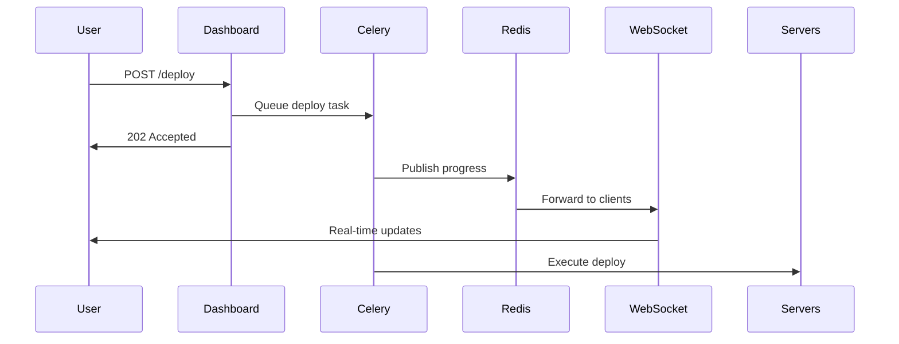
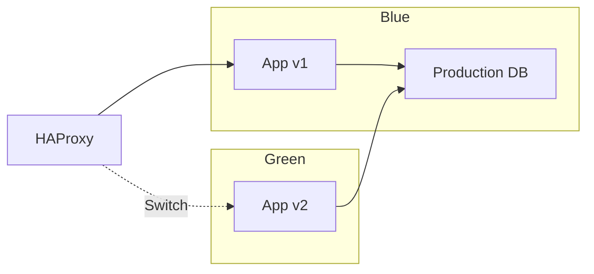
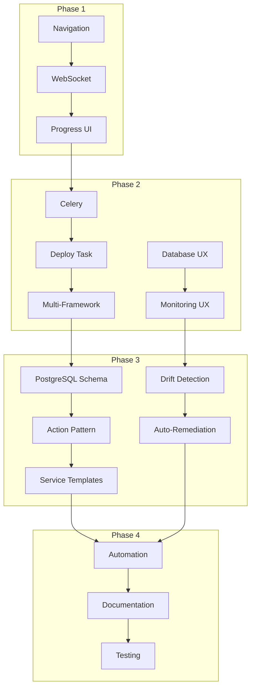

# PaaS Implementation Roadmap

> Phased implementation plan for evolving the Quantyra dashboard into a full-featured private PaaS.

## Overview

This roadmap defines the implementation phases, timelines, and deliverables for enhancing the infrastructure dashboard based on patterns from Coolify PaaS analysis.

### Current State (March 2026)

| Capability | Status | Notes |
|------------|--------|-------|
| Application Deployment | ✅ Working | Laravel via GitHub webhook |
| Domain Provisioning | ✅ Working | DNS + SSL via Cloudflare |
| Database Management | ✅ Working | PostgreSQL with permissions |
| Secrets Management | ✅ Working | SOPS encryption |
| Staging Environments | ✅ Working | Password protected |
| Health Checks | ✅ Working | Deploy validation |
| Monitoring | ✅ Working | Prometheus + Grafana |
| Real-time Progress | ⏳ Needed | WebSocket support |
| Background Jobs | ⏳ Needed | Celery for async deploys |
| Multi-framework | ⏳ Partial | Laravel complete, others need testing |
| Service Templates | ❌ Not Started | Add-on services |
| Team Collaboration | ❌ Not Started | Multi-user support |

## Phase 1: UX Foundation (Weeks 1-2)

**Goal:** Improve user experience with better navigation, progress visibility, and error handling.

### Week 1: Navigation & Information Architecture

#### Tasks

| Task | Priority | Effort | Dependencies |
|------|----------|--------|--------------|
| Refactor navigation structure | P0 | 4h | None |
| Add breadcrumb navigation | P0 | 2h | Navigation refactor |
| Implement sidebar collapse | P1 | 2h | Navigation refactor |
| Add global search (Cmd+K) | P2 | 4h | None |
| Mobile responsive navigation | P1 | 4h | None |

#### Navigation Structure

```
Dashboard (Home)
├── Overview
├── Applications
│   ├── List
│   ├── Create (+)
│   └── [App Detail]
│       ├── Overview (default)
│       ├── Deployments
│       ├── Domains
│       ├── Secrets
│       ├── Databases
│       ├── Logs
│       └── Settings
├── Servers
├── Databases
├── Monitoring
└── Settings
```

#### Deliverables

- [ ] Updated navigation with icons and collapse
- [ ] Breadcrumb trail on all pages
- [ ] Mobile-responsive bottom navigation
- [ ] Global search modal (Cmd+K)

### Week 2: Progress & Error UX

#### Tasks

| Task | Priority | Effort | Dependencies |
|------|----------|--------|--------------|
| Real-time deploy progress | P0 | 8h | WebSocket setup |
| Error display improvements | P0 | 2h | None |
| Rollback UI | P0 | 4h | Deploy history |
| Empty states | P1 | 2h | None |
| Toast notifications | P1 | 2h | None |

#### Deployment Progress Wireframe

```
┌─────────────────────────────────────────┐
│ Deploying rentalfixer                    │
│ production • main • a1b2c3d              │
├─────────────────────────────────────────┤
│ re-db (Primary)           ● Running     │
│ ├─ ✅ Pull code (2s)                     │
│ ├─ ✅ Install deps (45s)                 │
│ ├─ 🔄 Migrations...                      │
│ └─ ⏳ Restart                            │
│                                          │
│ re-node-02 (Secondary)     ⏳ Waiting   │
│                                          │
│ ━━━━━━━━━━━━━━━━━━━━  60%               │
│ Started 47s ago • ETA ~30s              │
└─────────────────────────────────────────┘
```

#### Deliverables

- [ ] WebSocket connection for real-time updates
- [ ] Progress bar with step details
- [ ] Error messages with actionable guidance
- [ ] Rollback button on failed deploys
- [ ] Empty states for all list views
- [ ] Toast notification system

---

## Phase 2: Feature Parity (Weeks 3-6)

**Goal:** Complete multi-framework support and enhance deployment capabilities.

### Week 3: WebSocket & Async Processing

#### Tasks

| Task | Priority | Effort | Dependencies |
|------|----------|--------|--------------|
| Set up Celery with Redis | P0 | 4h | Redis running |
| Configure flask-socketio | P0 | 4h | None |
| Create deploy task | P0 | 6h | Celery setup |
| WebSocket progress emitter | P0 | 4h | SocketIO setup |
| Handle reconnection | P1 | 2h | WebSocket setup |

#### Architecture



#### Deliverables

- [ ] Celery worker service on router-01
- [ ] Redis message broker configured
- [ ] flask-socketio integrated
- [ ] Deploy task with progress emissions
- [ ] WebSocket client in dashboard

### Week 4: Multi-Framework Support

#### Tasks

| Task | Priority | Effort | Dependencies |
|------|----------|--------|--------------|
| Next.js deploy support | P0 | 6h | None |
| SvelteKit deploy support | P0 | 6h | None |
| Python (Flask/Django) support | P1 | 6h | None |
| Go binary support | P1 | 4h | None |
| Framework auto-detection | P1 | 4h | None |

#### Framework Configuration

```yaml
# Framework templates
laravel:
  install: composer install --no-interaction --optimize-autoloader
  build: npm run build
  migrate: php artisan migrate --force
  runtime: nginx + php-fpm
  health_check: /

nextjs:
  install: npm ci
  build: npm run build
  runtime: systemd + node
  health_check: /
  port_range: 8300-8399

svelte:
  install: npm ci
  build: npm run build
  runtime: systemd + node
  health_check: /
  port_range: 8300-8399

python:
  install: pip install -r requirements.txt
  build: null
  migrate: python manage.py migrate  # Django only
  runtime: systemd + gunicorn
  health_check: /health
  port_range: 8400-8499

go:
  install: go mod download
  build: go build -o app .
  runtime: systemd
  health_check: /health
  port_range: 8500-8599
```

#### Deliverables

- [ ] Next.js deployment working
- [ ] SvelteKit deployment working
- [ ] Python deployment working
- [ ] Go deployment working
- [ ] Auto-detection from repo

### Week 5: Deployment Enhancements

#### Tasks

| Task | Priority | Effort | Dependencies |
|------|----------|--------|--------------|
| Blue-green deployment | P1 | 8h | None |
| PR preview deployments | P2 | 8h | WebSocket |
| Deployment scheduling | P2 | 4h | Celery beat |
| Deploy notifications | P1 | 4h | None |
| Deployment hooks | P2 | 6h | None |

#### Blue-Green Architecture



#### Deliverables

- [ ] Blue-green deployment option
- [ ] PR preview URLs (optional)
- [ ] Scheduled deployments
- [ ] Slack/Email notifications
- [ ] Pre/post deploy hooks

### Week 6: Database & Monitoring UX

#### Tasks

| Task | Priority | Effort | Dependencies |
|------|----------|--------|--------------|
| Database metrics dashboard | P1 | 4h | Prometheus |
| Query performance insights | P2 | 6h | PostgreSQL |
| Backup management UI | P1 | 4h | Backup scripts |
| Alert configuration UI | P1 | 4h | Alertmanager |
| Metrics explorer | P2 | 6h | Prometheus |

#### Database Dashboard

```
┌─────────────────────────────────────────┐
│ Database: rentalfixer_prod               │
├─────────────────────────────────────────┤
│ Size: 120 MB    Connections: 15/200     │
│ Queries/sec: 45    Slow queries: 3      │
│                                          │
│ ┌─────────────────────────────────────┐  │
│ │ [Tables] [Query] [Backups]          │  │
│ └─────────────────────────────────────┘  │
│                                          │
│ Recent Backups:                          │
│ • 2026-03-26 00:00  115 MB  [Restore]   │
│ • 2026-03-25 00:00  114 MB  [Restore]   │
└─────────────────────────────────────────┘
```

#### Deliverables

- [ ] Database size and connection metrics
- [ ] Query performance stats
- [ ] Backup list with restore
- [ ] Alert rule configuration
- [ ] Metrics explorer page

---

## Phase 3: Advanced Features (Weeks 7-10)

**Goal:** Add sophisticated PaaS features like service templates, scaling, and collaboration.

### Week 7: PostgreSQL Schema Migration

#### Tasks

| Task | Priority | Effort | Dependencies |
|------|----------|--------|--------------|
| Create database schema | P0 | 4h | None |
| Migrate YAML to PostgreSQL | P0 | 6h | Schema |
| Update models layer | P0 | 8h | Migration |
| Add migration scripts | P0 | 2h | Schema |
| Test with existing apps | P0 | 4h | Migration |

#### Schema Overview

```sql
-- Core tables
CREATE TABLE servers (...);
CREATE TABLE applications (...);
CREATE TABLE environments (...);
CREATE TABLE domains (...);
CREATE TABLE deployments (...);
CREATE TABLE environment_variables (...);

-- Resource tables (polymorphic)
CREATE TABLE resources (...);
CREATE TABLE resource_databases (...);
CREATE TABLE resource_services (...);
```

#### Deliverables

- [ ] PostgreSQL database created
- [ ] Schema deployed
- [ ] Data migrated from YAML
- [ ] Dashboard using PostgreSQL
- [ ] Rollback script ready

### Week 8: Action Pattern Implementation

#### Tasks

| Task | Priority | Effort | Dependencies |
|------|----------|--------|--------------|
| Create base action class | P0 | 4h | None |
| Implement DeployAction | P0 | 6h | Base action |
| Implement RollbackAction | P0 | 4h | Base action |
| Implement ProvisionAction | P1 | 6h | Base action |
| Implement BackupAction | P1 | 4h | Base action |

#### Action Class Structure

```python
# actions/base.py
class BaseAction:
    def execute(self) -> ActionResult
    def pre_execute(self) -> bool
    def post_execute(self, result) -> None

# actions/deploy.py
class DeployAction(BaseAction):
    def _execute(self) -> ActionResult:
        # 1. git_pull
        # 2. install_deps
        # 3. migrate
        # 4. restart
        # 5. health_check
```

#### Deliverables

- [ ] Base action class with error handling
- [ ] Deploy action with progress emission
- [ ] Rollback action
- [ ] Domain provision action
- [ ] Database backup action

### Week 9: Service Templates

#### Tasks

| Task | Priority | Effort | Dependencies |
|------|----------|--------|--------------|
| Define service templates | P1 | 4h | None |
| Redis service template | P1 | 4h | Templates |
| Meilisearch template | P2 | 4h | Templates |
| MinIO template | P2 | 4h | Templates |
| Service UI | P1 | 6h | Templates |

#### Available Services

| Service | Purpose | Port | Docker Image |
|---------|---------|------|--------------|
| Redis | Caching | 6379 | redis:7-alpine |
| Meilisearch | Search | 7700 | getmeili/meilisearch |
| MinIO | Object Storage | 9000 | minio/minio |
| RabbitMQ | Queue | 5672 | rabbitmq:3-management |

#### Deliverables

- [ ] Service template definitions
- [ ] Redis add-on working
- [ ] Meilisearch add-on working
- [ ] Service management UI
- [ ] Service metrics integration

### Week 10: Configuration Drift Detection

#### Tasks

| Task | Priority | Effort | Dependencies |
|------|----------|--------|--------------|
| Define expected configurations | P1 | 4h | None |
| Implement drift detection | P1 | 6h | Configs |
| Drift alerting | P1 | 4h | Detection |
| Auto-remediation | P2 | 6h | Detection |
| Drift dashboard | P1 | 4h | Detection |

#### Drift Detection Example

```python
# services/drift/detector.py
EXPECTED_CONFIG = {
    'php-fpm': {
        'max_children': 80,
        'memory_limit': '256M'
    },
    'nginx': {
        'worker_connections': 4096
    },
    'postgresql': {
        'max_connections': 200
    }
}

def check_drift(server_ip: str) -> List[DriftResult]:
    results = []
    
    for service, expected in EXPECTED_CONFIG.items():
        actual = get_actual_config(server_ip, service)
        for key, expected_value in expected.items():
            if actual.get(key) != expected_value:
                results.append(DriftResult(
                    server=server_ip,
                    service=service,
                    key=key,
                    expected=expected_value,
                    actual=actual.get(key)
                ))
    
    return results
```

#### Deliverables

- [ ] Configuration baseline defined
- [ ] Drift detection running hourly
- [ ] Prometheus alerts for drift
- [ ] Drift dashboard in UI
- [ ] Auto-remediation option

---

## Phase 4: Automation & Polish (Weeks 11-12)

**Goal:** Polish the experience, add automation features, and prepare for production use.

### Week 11: Automation Features

#### Tasks

| Task | Priority | Effort | Dependencies |
|------|----------|--------|--------------|
| Auto-SSL renewal | P0 | 4h | Certbot |
| Auto-backup scheduling | P0 | 4h | Celery beat |
| Auto-scaling (basic) | P2 | 8h | Metrics |
| Auto-deploy on schedule | P1 | 4h | Celery beat |
| Cleanup automation | P1 | 4h | Celery beat |

#### Celery Beat Schedule

```python
CELERYBEAT_SCHEDULE = {
    # SSL renewal check (twice daily)
    'check-ssl-expiration': {
        'task': 'tasks.ssl.check_expiration',
        'schedule': crontab(hour='0,12', minute=0),
    },
    
    # Database backups (hourly)
    'backup-databases': {
        'task': 'tasks.backup.backup_all',
        'schedule': crontab(minute=0),
    },
    
    # Cleanup old deployments (daily)
    'cleanup-deployments': {
        'task': 'tasks.maintenance.cleanup',
        'schedule': crontab(hour=3, minute=0),
    },
    
    # Configuration drift check (hourly)
    'check-config-drift': {
        'task': 'tasks.drift.check_all_servers',
        'schedule': crontab(minute=30),
    },
}
```

#### Deliverables

- [ ] SSL auto-renewal verified
- [ ] Backup schedule UI
- [ ] Scheduled deployments
- [ ] Automated cleanup jobs
- [ ] Drift detection automation

### Week 12: Documentation & Testing

#### Tasks

| Task | Priority | Effort | Dependencies |
|------|----------|--------|--------------|
| User documentation | P0 | 8h | All features |
| API documentation | P0 | 4h | API complete |
| Runbook creation | P0 | 4h | All features |
| End-to-end testing | P1 | 8h | All features |
| Performance testing | P2 | 4h | E2E tests |

#### Documentation Structure

```
docs/
├── getting-started.md      # Quick start guide
├── applications/
│   ├── creating.md         # App creation wizard
│   ├── deploying.md        # Deployment guide
│   └── frameworks/         # Framework-specific docs
│       ├── laravel.md
│       ├── nextjs.md
│       └── python.md
├── domains/
│   ├── provisioning.md     # Domain setup
│   └── ssl.md             # SSL management
├── databases/
│   ├── management.md       # DB operations
│   └── backups.md         # Backup/restore
├── monitoring/
│   ├── metrics.md          # Metrics overview
│   └── alerts.md          # Alert setup
└── api/
    ├── reference.md        # API reference
    └── webhooks.md         # Webhook setup
```

#### Deliverables

- [ ] Complete user documentation
- [ ] API reference documentation
- [ ] Operational runbooks
- [ ] E2E test suite
- [ ] Performance benchmarks

---

## Dependency Graph



## Risk Assessment

| Risk | Probability | Impact | Mitigation |
|------|-------------|--------|------------|
| WebSocket scalability | Medium | High | Use Redis pub/sub, horizontal scaling |
| Celery worker failures | Medium | Medium | Task retries, dead letter queue |
| Database migration issues | Low | High | Backup before migration, rollback script |
| Multi-framework complexity | Medium | Medium | Thorough testing per framework |
| Performance degradation | Low | Medium | Load testing, caching |

## Success Metrics

### Phase 1 Success

- [ ] Navigation rated "easy to use" by user
- [ ] Deploy progress visible within 1 second of starting
- [ ] Error messages actionable (user knows what to do)

### Phase 2 Success

- [ ] All 5 frameworks deployable
- [ ] WebSocket reconnects without page refresh
- [ ] Deployments complete in under 5 minutes

### Phase 3 Success

- [ ] Zero data loss during YAML → PostgreSQL migration
- [ ] Action classes reduce code duplication by 40%
- [ ] Drift detection catches all configuration changes

### Phase 4 Success

- [ ] SSL auto-renewal works without manual intervention
- [ ] Documentation covers 100% of user flows
- [ ] E2E tests cover 80% of critical paths

## Resource Requirements

### Infrastructure

| Resource | Current | Required | Notes |
|----------|---------|----------|-------|
| Redis Memory | 2 GB | 4 GB | Message broker + pub/sub |
| PostgreSQL | Existing | New DB | `quantyra_paas` database |
| Celery Workers | None | 2 vCPU | On router-01 |

### Development Time

| Phase | Duration | Effort |
|-------|----------|--------|
| Phase 1 | 2 weeks | 40 hours |
| Phase 2 | 4 weeks | 80 hours |
| Phase 3 | 4 weeks | 80 hours |
| Phase 4 | 2 weeks | 40 hours |
| **Total** | **12 weeks** | **240 hours** |

## Maintenance & Operations

### Daily Tasks

- Check Celery worker logs
- Monitor WebSocket connections
- Verify backup completion

### Weekly Tasks

- Review failed deployments
- Check SSL expiration status
- Update package versions

### Monthly Tasks

- Review and update documentation
- Performance testing
- Security audit

## Future Considerations

### Beyond Phase 4

| Feature | Description | Priority |
|---------|-------------|----------|
| Multi-region support | Deploy across multiple regions | Future |
| Kubernetes integration | K8s deployment option | Future |
| AI-assisted debugging | Log analysis with AI | Future |
| Cost optimization | Resource right-sizing | Future |
| Multi-tenant support | Team isolation | Future |

---

## Quick Reference

### Command Reference

```bash
# Start Celery worker
celery -A tasks worker --loglevel=info

# Start Celery beat (scheduler)
celery -A tasks beat --loglevel=info

# Check task status
celery -A tasks result <task_id>

# Monitor tasks
celery -A tasks events

# Run specific task
celery -A tasks call tasks.deploy.deploy_application --args='["app_name", "main", "production"]'
```

### File Structure

```
dashboard/
├── app.py                 # Flask application
├── actions/
│   ├── base.py           # Base action class
│   ├── deploy.py         # Deploy actions
│   └── rollback.py       # Rollback actions
├── tasks/
│   ├── __init__.py       # Celery app
│   ├── deploy.py         # Deploy tasks
│   └── backup.py         # Backup tasks
├── services/
│   ├── ssh.py            # SSH connection pool
│   └── cloudflare.py     # Cloudflare API
├── models/
│   ├── application.py    # Application model
│   └── database.py       # Database model
└── websocket/
    └── handlers.py       # Socket.IO handlers
```

### Configuration Files

```yaml
# config/celery.yml
broker_url: redis://100.126.103.51:6379/1
result_backend: redis://100.126.103.51:6379/2
task_serializer: json
result_serializer: json

# config/services.yml
services:
  redis:
    image: redis:7-alpine
    port: 6379
  meilisearch:
    image: getmeili/meilisearch:latest
    port: 7700
```

---

*Document created: March 2026*
*Last updated: March 2026*
*Status: Draft for review*